# **Blackjack**
Developed by Michael Roberts

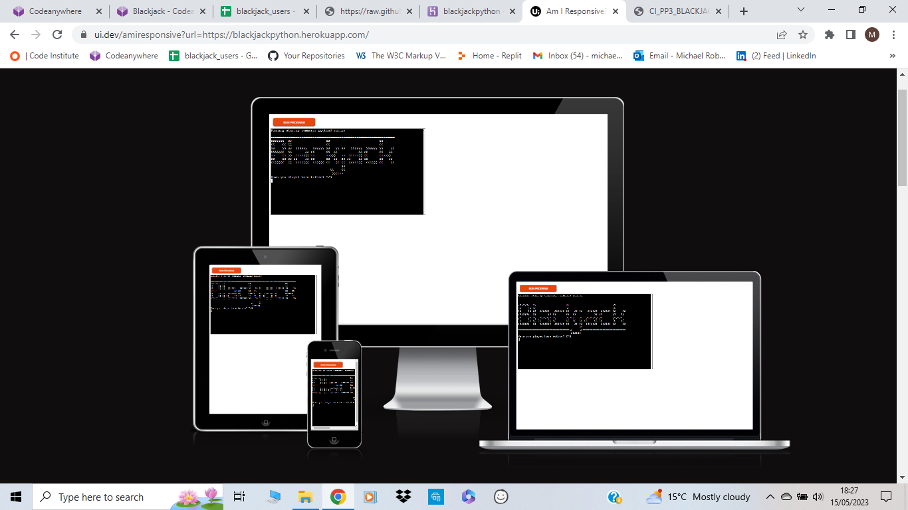

[Link to live site](https://blackjackpython.herokuapp.com/)

## Introduction
Blackjack, also known as 21, is a card game where players attempt to reach a score of 21 — without exceeding it and losing the hand. You win the hand if you don't bust and your total is higher than the dealers cards.

The player creates an account to get their game chips and places bets on blackjack hands against an automated dealer. Any winnings can be stored in the players account to bet with next time they play the game.

## Contents
* [Project Goals](#project-goals)
    * [User Goals](#user-goals)
    * [Site Owner Goals](#site-owner-goals)
* [User Experience](#user-experience)
    * [Target Audience](#target-audience)
    * [User Requirements](#user-requirements)
    * [User Manual](#user-manual)
    * [User Stories](#user-stories)
* [Technical Design](#technical-design)
    * [Flowchart](#flowchart)
    * [Data Models](#data-models)
* [Features](#features)
    * [App Features](#app-features)
    * [Feature Ideas for future development](#feature-ideas-for-future-development)
* [Technologies Used](#technologies-used)
    * [Languages Used](#languages-used)
    * [Other Tools Used](#other-tools-used)
    * [3rd Party Python Libraries Used](#3rd-party-python-libraries-used)
* [Deployment & Local Development](#deployment--local-development)
* [Testing](#testing)
    * [Validation](#validation)
    * [Manual Testing](#manual-testing)
    * [Bugs](#bugs)
* [Credits](#credits)
    * [3rd Party Python Libraries/Code](#3rd-party-python-libraries/code)
    * [Acknowlegements](#acknowledgements)

## Project Goals
### User Goals
* Play a blackjack game and try and win as many chips as possible.
* To understand the instructions and how to play the game.
* To sign up with a new account.
* Log back in to an existing account.

### Site Owner Goals
* To provide users with clear instructions on how to play the game and navigate the program.
* To make sure any user errors are handled and communicated back to the user.

## User Experience
### Target Audience
* This game is targeted at people with an interest in Blackjack and people with an interest in computer gaming in general.

### User Requirements
* A game that is understandable and works as expected.
* Log-in works as expected and validates user input correctly.
* Game moves and the betting system is clearly communicated and displayed to the user.
* User can quit the game when they want.

### User Manual
Click the dropdown to view the user manual:

User Manual

### Sign In/Sign Up
When the program starts, the user will be prompted to either:
* Enter their existing login.
* Sign up for a new account.
This choice is navigated by inputting Y or N on the keyboard and pressing enter to submit.

The user will then enter their account details to sign in, or enter a new username and password to create an account and sign in. Correct case sensitive user details must be entered to validate account access.

### Main Menu
The useer will be taken to the game menu where they will see their chips balance and be given three options:
* Enter I to see game instructions
* Enter S to start the game
* Enter X to exit the game

### Game Instructions
If I is selected at the main menu, a screen detailing game instructions will appear.
The user can proceed to the game or return to the main menu.

### Play Game
When the user starts the game, they will:
* Be taken to a betting screen where they can see their chips balance and place a bet.
* Continue to the game screen where they can see their first two cards and one of the dealers cards. The user then has three possible moves:
    * Enter H to hit and draw another card
    * Enter D to double down on their bet and draw another card
    * Enter S to stand and take no more cards
* The dealer makes their move and the game continues in turn until one player busts or both players take no more cards, reveal their cards and the game result is evaluated.
* Once the result has been evaluated the chips will be added to or taken from the users chips balance, the user can then play another round or quit the game.
* If a user loses all their chips, they will be prompted to press any key to get more chips and 5000 chips will be added to their account so they can continue to play.
    
### Exit Game
The user can exit the game by inputting X in the main menu or EXIT before placing a new bet. User will be asked if they are sure they want to exit the game:
* Enter Y to exit the game.
* Enter N to go to the game menu.

### User Stories
#### First Time User
1. As a first time user, I want to set a username and password to sign up for a game account.
2. As a first time user, I want to see clear instructions on how to play the game before starting.
3. As a first time user, I want to have a visual representation of the Blackjack game as I am playing it.
4. As a first time user, I want inputs to work as expected and any errors to be flagged by the program.
5. As a first time user, I want the program to be responsive and provide clear progress and feedback through the steps of the game.

#### Returning User 
6. As a returning user, I want to be able to log in with my existing username and password.
7. As a returning user, I want to be able to continue the game with my previous chips balance.
8. As a returning user, I want to be able skip the instructions if they I'm already familiar with the game.

#### Site Owner
9. As a site owner, I want to ensure that all data entered by the user is validated so as not to break the program or create bad user experience.
10. As a site owner, I want to ensure that all user actions are given feedback in the terminal so that users know what to do next in the game.

## Technical Design
### Flowchart
A flowchart was created using [Lucidchart](https://lucid.app/) to visualise the logic flow of the game.

    
Flowchart

    
Blackjack game logic:

    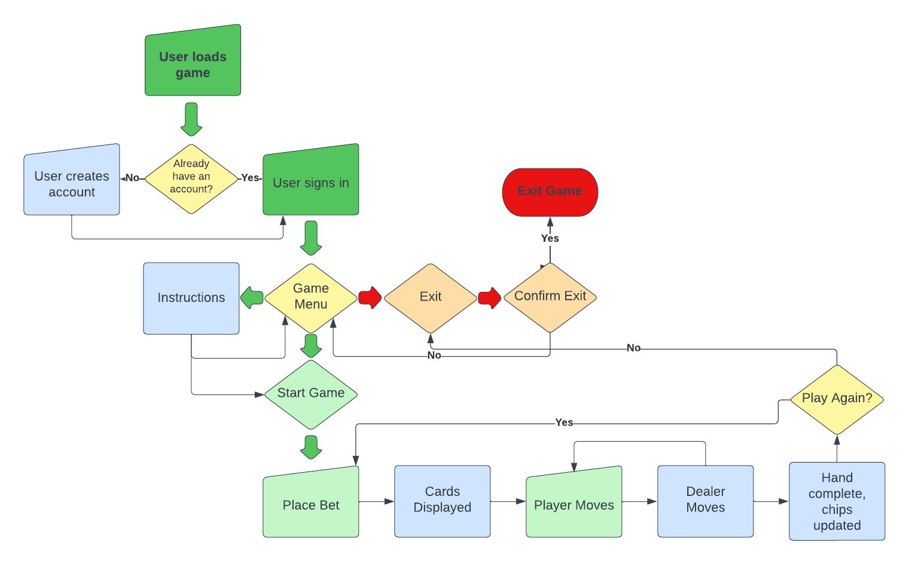

 

### Data Models
* Dictionaries were used to store user data.
    * This was used to verify user details when signing up and signing into the game and to keep a running balance of game chips for each user.
* Lists of tuples were used to format the card layout.
    * These lists could then be iterated through at random to make player and dealer hands.
* The Google Sheets API was used for user data.
    * This allows user data to be saved so a user can create an account and use it to sign in to the game.

## Features
The website has a single page with several features within the mock python terminal. These features are listed below.
### App Features

    
Game Title

    
This is what the user sees upon loading the site. The title text appears with a simple animation for visual appeal. There is also a login/signup feature here.

    <ul>
        <li>
            
Sign Up/Sign In 

        </li>
        <li>
            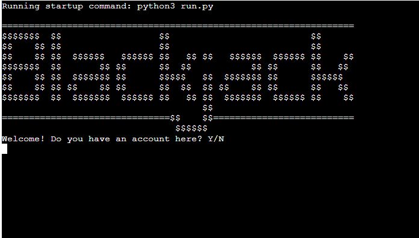
        </li>
        <li>
            
User story covered: 1, 6, 7

        </li>
        <li>
            
User Validation - you cannot log in with an account that doesn't exist or with an incorrect password.

        </li>
        <li>
            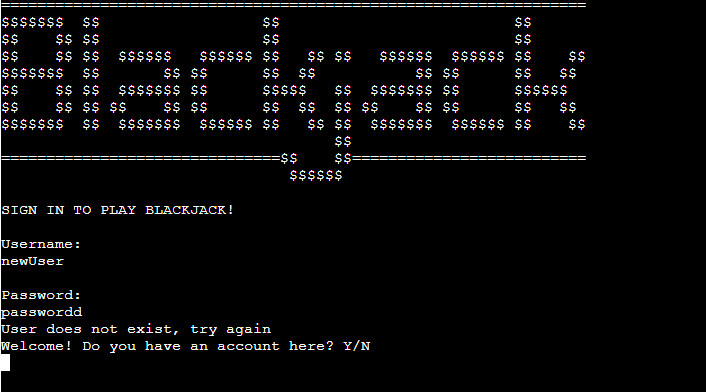
            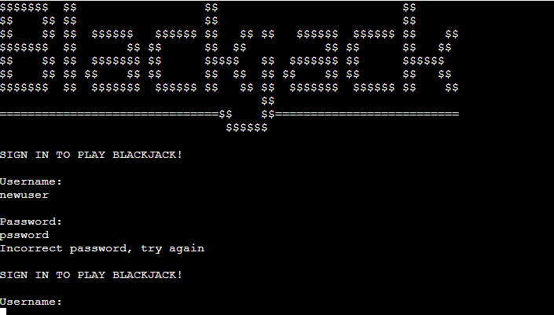
        </li>
        <li>
            
User story covered: 4, 9

        </li>
    </ul>

    
Menu

    
This is what the user sees upon loggin in successfully.

    <ul>
        <li>
            
Game Menu, allowing the player to start the game, view instructions, or exit.

        </li>
        <li>
            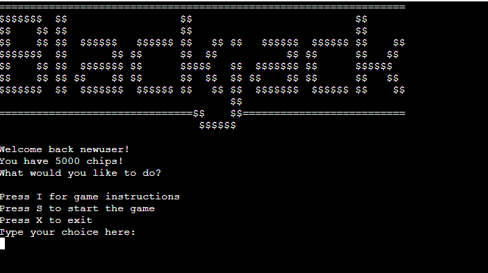
        </li>
        <li>
            
User story covered: 2, 8

        </li>
        <li>
            
Game Instructions, showing the user how to play the game.

        </li>
        <li>
            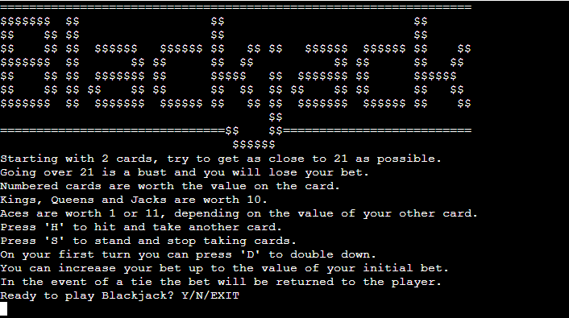
        </li>
        <li>
            
User stories covered: 2, 8

        </li>
        <li>
            
Exit Game.

        </li>
        <li>
            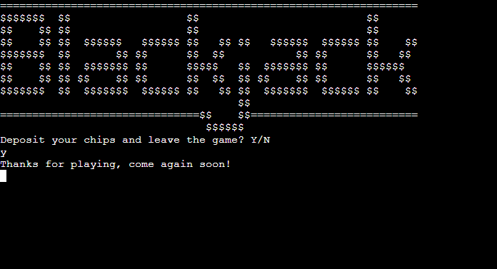
        </li>

    
Blackjack Game

    
This is what the user sees when starting the game from the game menu.

    <ul>
        <li>
            
An input for the user to place their bets from their available game chips.

        </li>
        <li>
            
        </li>
        <li>
            
User story covered: 3, 5, 10

        </li>
        <li>
            
A representation of the Blackjack game featuring game cards and move options to Hit, Stand or Double Down.

        </li>
        <li>
            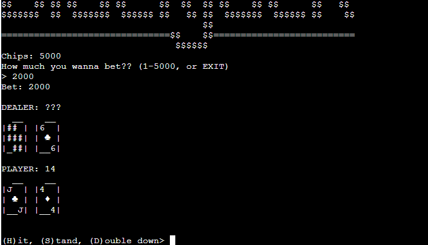
        </li>
        <li>
            
User story covered: 3, 5, 10

        </li>
        <li>
            
When each hand is completed, the players chips balance is updated and they are given the option to play another hand or deposit their chips and exit the game.

        </li>
        <li>
            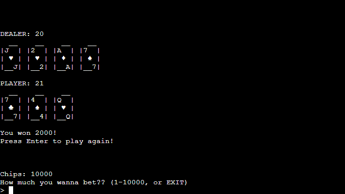
        </li>
        <li>
            
User story covered: 3, 5, 10

        </li>

### Feature Ideas for Future Development
In future the website could be further developed and improved to offer more games and expand into a general casino-type application, with additional games such as poker, roulette and slot machine games.

## Technologies Used
### Languages Used
Python

### Other Tools Used
* [Git](https://git-scm.com/) was used for version control.
* [GitHub](https://github.com/) was used for saving and storing files.
* [CodeAnywhere](https://app.codeanywhere.com/) was the IDE used for writing and editing code.
* [Heroku](https://id.heroku.com/) was used as the hosting platform for this site.
* [ASCII art generator](https://patorjk.com/software/taag/#p=display&f=Big%20Money-ne&t=Blackjack) was used to generate title text.
* [PEP8 Python Validator](https://pep8ci.herokuapp.com/) Code institute's own Python Linter was used to validate all Python code in this project.
* [Lucidchart](https://lucid.app/) was used to create logic flowchart.
* [amiresponsive](https://ui.dev/amiresponsive) was used to test the website across different screens and generate the picture at the head of this file.

### 3rd Party Python Libraries Used
* [Gspread / Google Sheets API](https://github.com/burnash/gspread) was used to handle getting/sending data to the google sheet used in the project. This is also not a standard feature of python, so it was necessary to install it for the purposes of this project.
* [Google OAuth 2.0](https://google-auth.readthedocs.io/en/stable/reference/google.oauth2.credentials.html) was used to set up the connection between the project and the developers personal google account. This was necessary because access to a google account via a program is restricted for security reasons.

## Deployment & Local Development
The website was deployed to [Heroku](https://id.heroku.com/) using the following process:
1. Login or create an account at [Heroku](https://dashboard.heroku.com/)
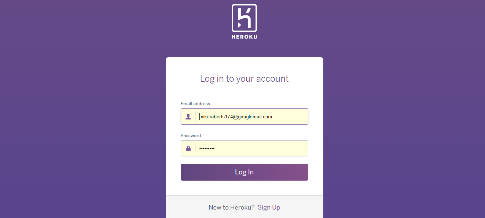
2. Click on New > Create new app in the top right of the screen.
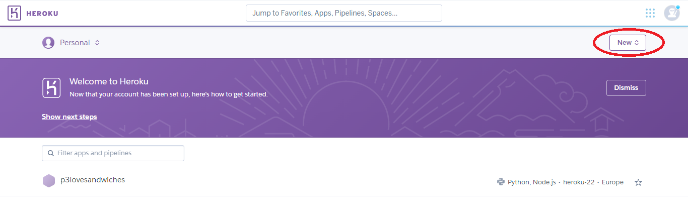
3. Add an app name and select location, then click 'create app'.
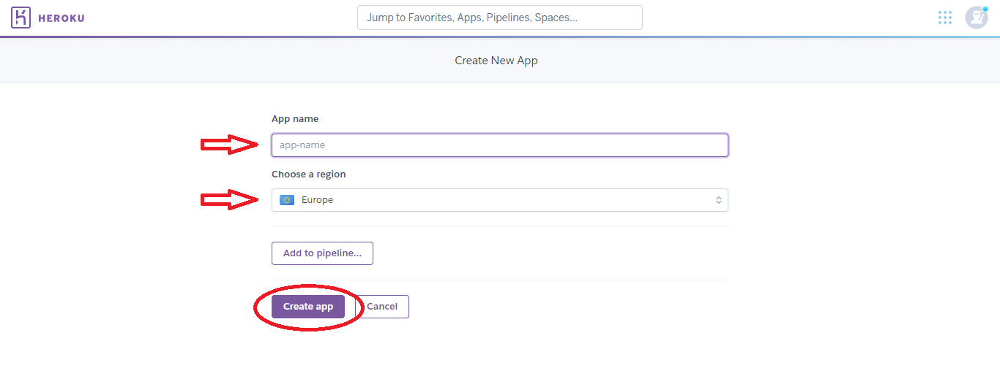
4. Under the deploy tab of the next page, select connect to GitHub.
5. Log in to your GitHub account when prompted.
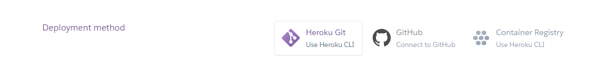
6. Select the repository that you want to be connected to the Heroku app.
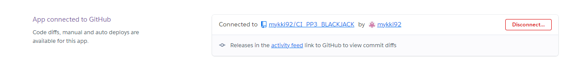
7. Click on the settings tab.

8. Scroll down to the config vars section, and add 2 config vars:
    * The first key is CREDS and the value here is the creds.json file that was generated for the google sheets API to work properly.
    * The second key is PORT and the Value is 8000
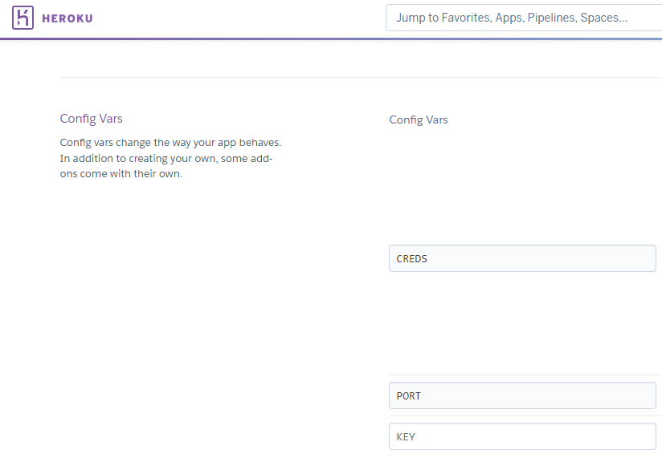
9. Once you have set up the config vars, scroll down to buildpacks (still under the settings tab)
10. Add the Python and Node.js buildpacks to your app and make sure that when they are displayed, they appear in the order:
    * Python
    * Node.JS
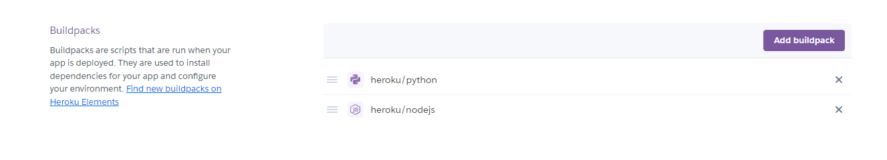
11. Navigate back to the settings tab.
12. Select automatic deploys to allow Heroku to build the site with new changes each time changes are pushed to GitHub.

13. In the 'manual deploy' section beneath this, make sure the branch selected is 'main' and click deploy branch.
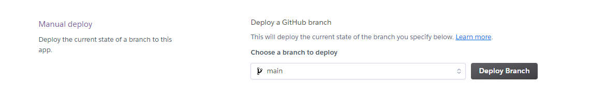
14. The site should now be built and Heroku should provide a url for the built site.

This repository can be forked using the following process:
1. On the repository's page, go to the top-right of the page underneath the dark ribbon.
2. Click on the fork button
3. You can now work on a fork of this project. 

This repository can be cloned using the following process:
1. Go to this repository's page on GitHub.
2. Click on the code button (not the one in the navbar, but the one right above the file list).
3. Select an option, HTTPS, SSH, GitHub CLI.
4. Copy the URL below to your clipboard.
5. Open Git Bash/your IDE terminal.
6. Ensure the directory you are working in is the correct one you want to paste the project into.
7. Type the command '$ git clone'.
8. Paste the URL of the repository after this.
9. Hit enter on your keyboard and the project will be cloned.

## Testing
### Validation

#### PEP8 Python Validator (Code Institute)
Code Institute's own Python Linter [pep8](https://pep8ci.herokuapp.com/) was used to validate all Python code in this project. All code passed with no errors.

run.py

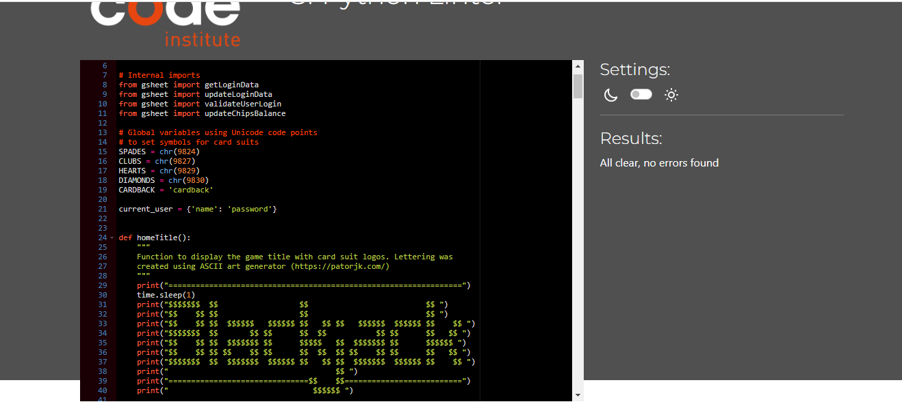
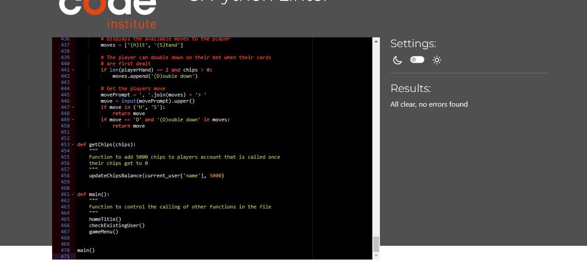

gsheet.py

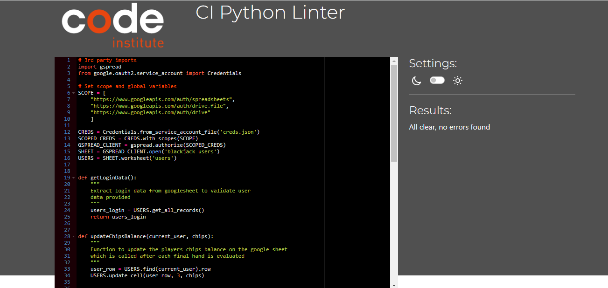
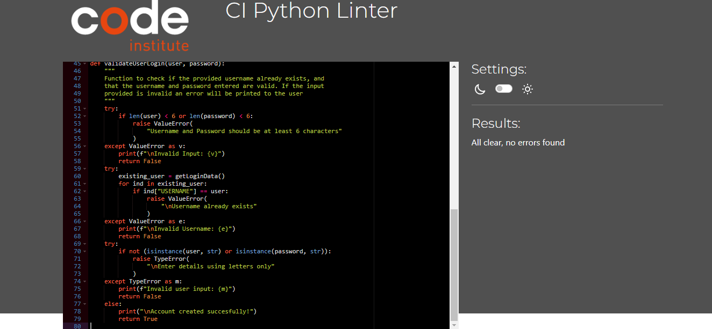

### Manual Testing
1. As a first time user, I want to set a username and password to sign up for a game account.

| **Feature** | **Action** | **Expected Result** | **Actual Result** |
|-------------|------------|---------------------|-------------------|
| Sign In/Sign Up | When prompted for an existing account at the start of the game, answer 'N' and enter new details | Program creates new user account. | Works as expected. |

    
Screenshots

    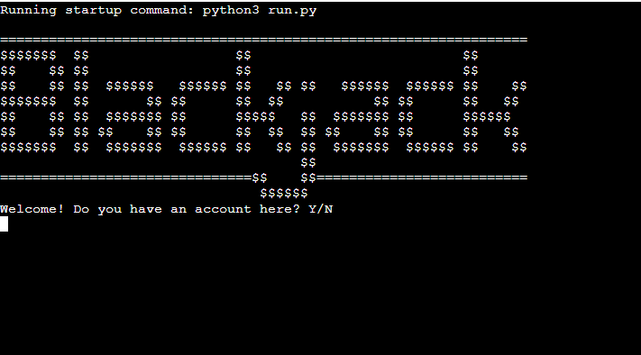
    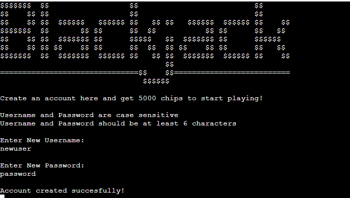
    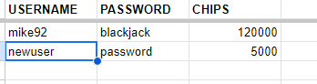

2. As a first time user, I want to see clear instructions on how to play the game before starting.

| **Feature** | **Action** | **Expected Result** | **Actual Result** |
|-------------|------------|---------------------|-------------------|
| Game Menu | When in the main menu, enter 'I' to access instructions. | Program displays instructions and a way to get back to the menu. | Works as expected. |

    
Screenshots

    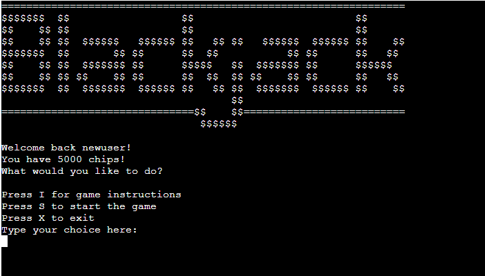
    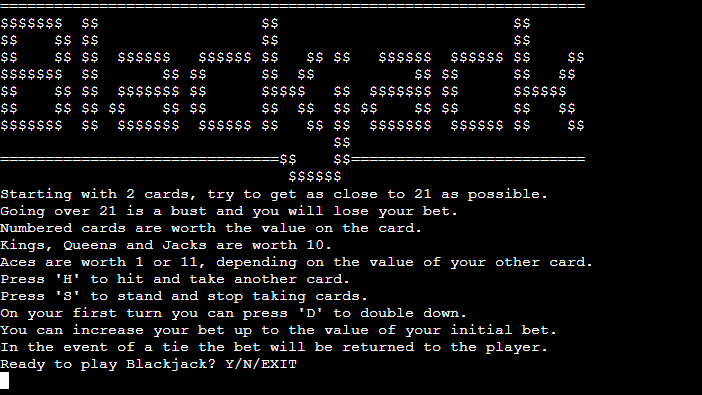

3. As a first time user, I want to have a visual representation of the Blackjack game as I am playing it.

| **Feature** | **Action** | **Expected Result** | **Actual Result** |
|-------------|------------|---------------------|-------------------|
| Main Game | Start the game. | Program displays betting function and game cards. | Works as expected. |

    
Screenshots

    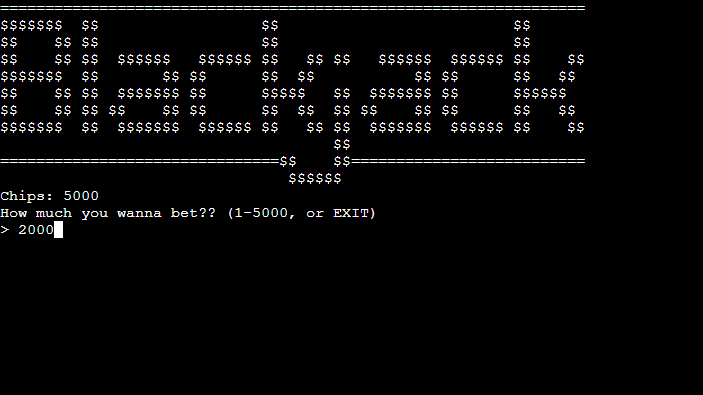
    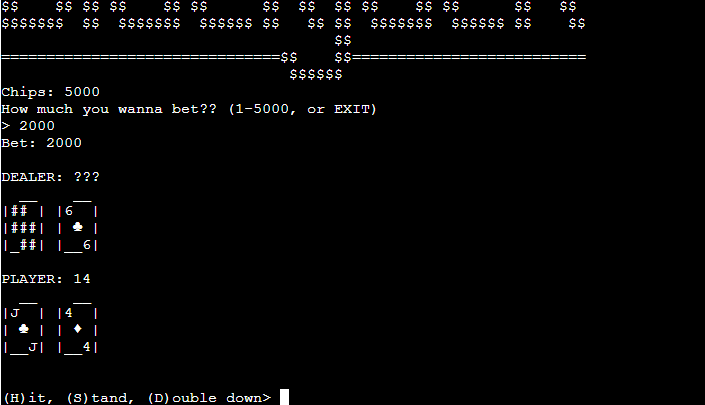

4. As a first time user, I want inputs to work as expected and any errors to be flagged by the program.

| **Feature** | **Action** | **Expected Result** | **Actual Result** |
|-------------|------------|---------------------|-------------------|
| Game Inputs | Enter an incorrect username, password or input. | Program flags the error and input must be entered again. | Works as expected. |

    
Screenshots

    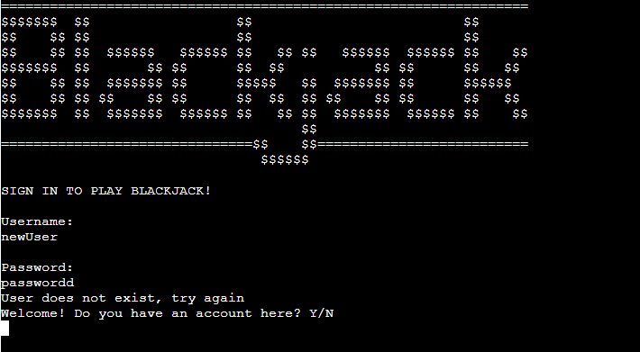
    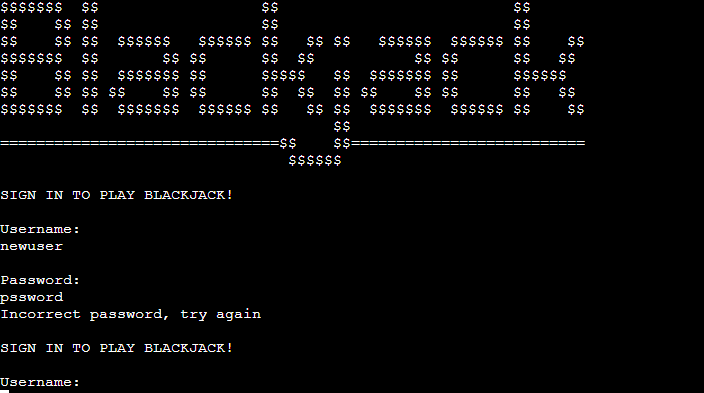
    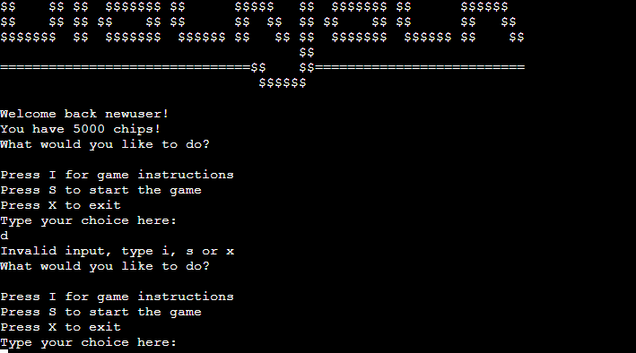
    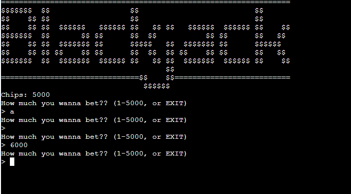
    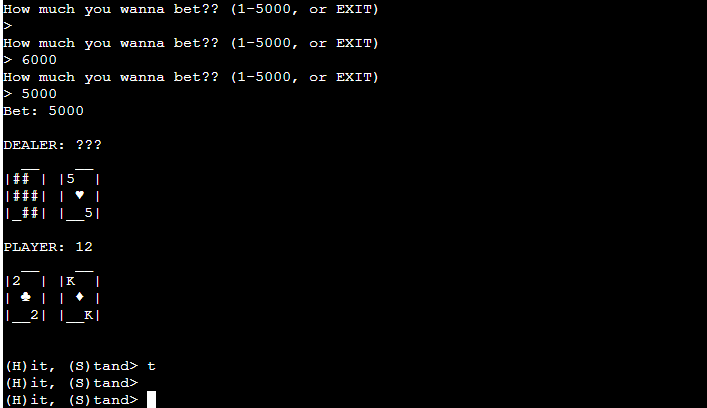

5. As a first time user, I want the program to be responsive and provide clear progress and feedback through the steps of the game.

| **Feature** | **Action** | **Expected Result** | **Actual Result** |
|-------------|------------|---------------------|-------------------|
| Main Game | Play through the game. | See clear feedback and game information and prompts for input. | Works as expected. |

    
Screenshots

    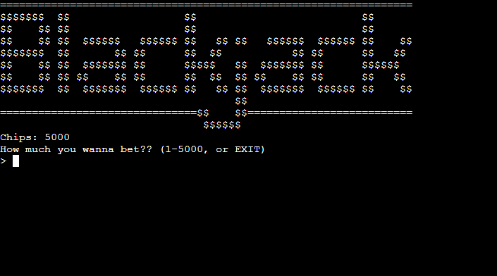
    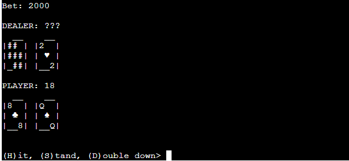
    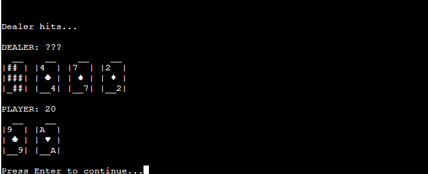
    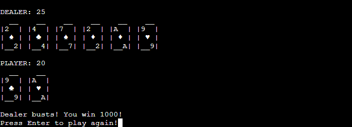
    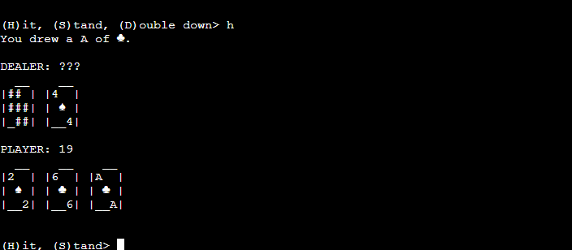

6. As a returning user, I want to be able to log in with my existing username and password.

| **Feature** | **Action** | **Expected Result** | **Actual Result** |
|-------------|------------|---------------------|-------------------|
| Sign In | When prompted for an existing account, input Y and enter your username and password | Sign in to your account to access the game. | Works as expected. |

    
Screenshots

    
    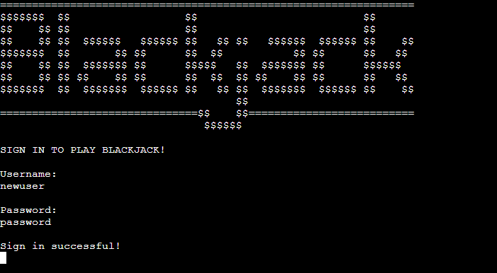
    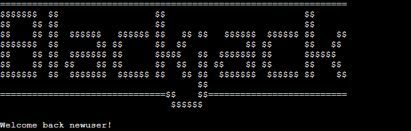

7. As a returning user, I want to be able to continue the game with my previous chips balance.

| **Feature** | **Action** | **Expected Result** | **Actual Result** |
|-------------|------------|---------------------|-------------------|
| Sign In | Sign in to your account when prompted at the start of the game. | Access your account and see a welcome message with your accrued chips balance to use in the game. | Works as expected. |

    
Screenshots

    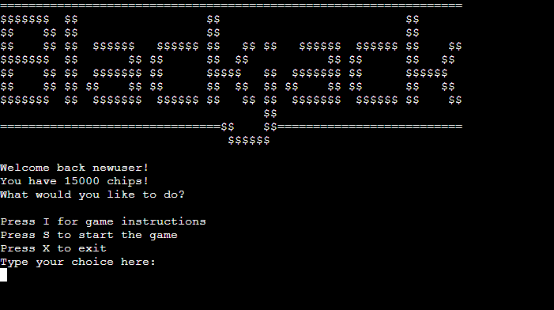
    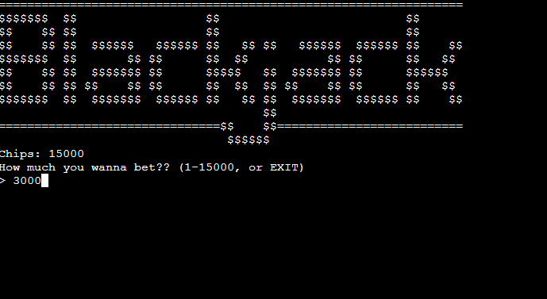

8. As a returning user, I want to be able skip the instructions if I'm already familiar with the game.

| **Feature** | **Action** | **Expected Result** | **Actual Result** |
|-------------|------------|---------------------|-------------------|
| Game Menu | When in main menu, enter 'S' to start the game immediately. | Game loads withput going to the menu screen. | Works as expected. |

    
Screenshots

    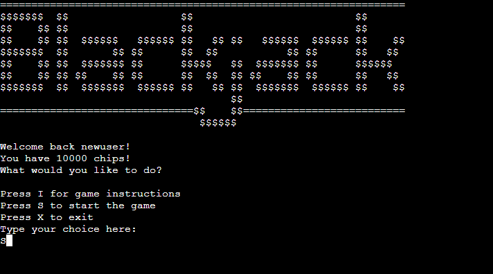

9. As a site owner, I want to ensure that all data entered by the user is validated so as not to break the program or create bad user experience.

| **Feature** | **Action** | **Expected Result** | **Actual Result** |
|-------------|------------|---------------------|-------------------|
| Game Inputs | Enter an incorrect username, password or input. | Program flags the error and a valid input must be entered to continue. | Works as expected. |

    
Screenshots

    
    
    
    
    

10. As a site owner, I want to ensure that all user actions are given feedback in the terminal so that users know what to do next in the game.

| **Feature** | **Action** | **Expected Result** | **Actual Result** |
|-------------|------------|---------------------|-------------------|
| Main Game | Enter an incorrect username, password or input. | Program flags the error and a valid input must be entered to continue. | Works as expected. |

    
Screenshots

    
    
    
    
    

### Bugs

| Bug Description  | Action Taken to Fix  |
|---|---|
|Between inputting their username and the password input loading, the user could input characters into empty lines, causing issues with login. | Remove time.sleep(1) from between the username and password inputs being loaded. |
| Validation issues when using "Press $ to get more chips". | Change input to "Press any button to get more chips". |
| When player clicks to get more chips, sometimes the sheet has not updated before the game restarts and the player has the wrong number of chips. | Insert time.sleep(3) in between the getChips and playBlackjack functions to allow time for the sheet to update. |

## Credits
### 3rd Party Python Libraries/Code
* [Gspread / Google Sheets API](https://github.com/burnash/gspread) was used to handle getting/sending data to the google sheet used in the project.
* [Google OAuth 2.0](https://google-auth.readthedocs.io/en/stable/reference/google.oauth2.credentials.html) was used to set up the connection between the project and the developers personal google account.
* [ASCII art generator](https://patorjk.com/software/taag/#p=display&f=Big%20Money-ne&t=Blackjack) was used to generate title text.

### Acknowledgements
* My Code Institute Mentor Mo Shami for his guidance and advice.
* Code Institute learning modules and tutor support.
