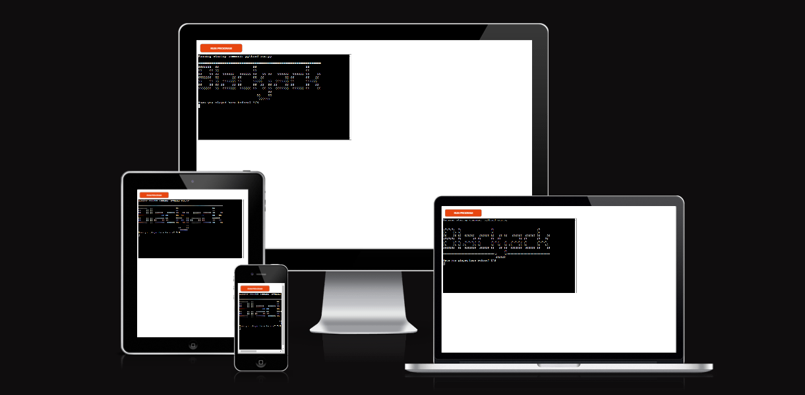
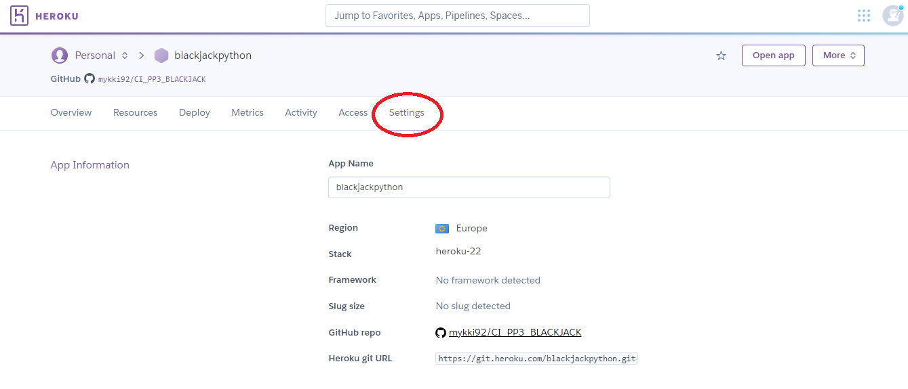

# **Blackjack**
Developed by Michael Roberts

[Link to live site](https://blackjackpython.herokuapp.com/)

## Introduction
Blackjack, also known as 21, is a card game where players attempt to reach a score of 21 — without exceeding it — before the dealer hits 17. You can win if you don't bust and your total is higher than the dealer cards.

## Contents
* [Project Goals](#project-goals) 
    * [User Goals](#user-goals)
    * [Site Owner Goals](#site-owner-goals)
* [User Experience](#user-experience) 
    * [Target Audience](#target-audience)
    * [User Requirements](#user-requirements)
    * [User Manual](#user-manual)
    * [User Stories](#user-stories)
* [Technical Design](#technical-design)
    * [Data Models](#data-models)
    * [Flowchart](#flowchart)
* [Features](#features)
    * [App Features](#app-features)
    * [Feature Ideas for future development](#feature-ideas-for-future-development)
* [Technologies Used](#technologies-used)
* [Deployment & Local Development](#deployment--local-development)
* [Testing](#testing)
    * [Validation](#validation)
    * [Manual Testing](#manual-testing)
    * [Automated Testing](#automated-testing)
    * [Bugs](#bugs)
* [Credits](#credits)

## Project Goals
### User Goals
* Play a blackjack game and try and win as many chips as possible.
* To understand the instructions and how to play the game.
* To sign up with a new account.
* Log back in to an existing account.

### Site Owner Goals
* To provide users with clear instructions on how to play the game and navigate the program.
* To make sure any user errors are handled and communicated back to the user.

## User Experience
### Target audience
* This game is targeted at people with an interest in Blackjack and people with an interest in computer gaming in general.

### User requirements
* A game that is understandable and works as expected.
* Log-in works as expected and validates user input correctly.
* Game moves and the betting system is clearly communicated and displayed to the user.
* User can quit the game when they want.

### User Manual

### User Stories
#### First Time User
1. Set a username and password to sign up for a game account.
2. Have instructions on how to play the game before starting.
3. To have a visual representation of the Blackjack game.
4. For inputs to work as expected and any errors to be flagged by the program.
5. For the program to be responsive and provide clear progress through the steps of the game.

#### Returning User 
7. Be able to log in with their existing username and password.
8. Be able skip the instructions if they are familiar with the game.

#### Site Owner
11. Ensure that all data entered by the user is validated so as not to break the program or create bad user experience.
12. Ensure that all user actions are given feedback in the terminal so that users know what to do next in the game.

## Technical Design
### Flowchart

### Data Models
* The Google Sheets API was used for user data.
    * This allows user data to be saved so a user can create an account and use it to sign in to the game.

## Features
The website has a single page with several features within the mock python terminal. These features are listed below.
### App Features

### Feature Ideas for Future Development
In future the website could be further developed and improved to offer more games and expand into a general casino-type application, with additional games such as poker, roulette and slot machine games.

## Technologies Used

### Languages Used
Python

### Other Tools Used
* [Git](https://git-scm.com/) was used for version control.
* [GitHub](https://github.com/) was used for saving and storing files.
* [CodeAnywhere](https://app.codeanywhere.com/) was the IDE used for writing and editing code.
* [Heroku](https://id.heroku.com/) was used as the hosting platform for this site.
* [ASCII art generator](https://patorjk.com/software/taag/#p=display&f=Big%20Money-ne&t=Blackjack) was used to generate title text.

#### 3rd Party Python Libraries Used
* [Gspread / Google Sheets API](https://github.com/burnash/gspread) was used to handle getting/sending data to the google sheet used in the project. This is also not a standard feature of python, so it was necessary to install it for the purposes of this project.
* [Google OAuth 2.0](https://google-auth.readthedocs.io/en/stable/reference/google.oauth2.credentials.html) was used to set up the connection between the project and the developers personal google account. This was necessary because access to a google account via a program is restricted for security reasons.

## Deployment & Local Development
The website was deployed to [Heroku](https://id.heroku.com/) using the following process:
1. Login or create an account at [Heroku](https://dashboard.heroku.com/)

2. Click on New > Create new app in the top right of the screen.

3. Add an app name and select location, then click 'create app'.

4. Under the deploy tab of the next page, select connect to GitHub.
5. Log in to your GitHub account when prompted.

6. Select the repository that you want to be connected to the Heroku app.

7. Click on the settings tab.

8. Scroll down to the config vars section, and add 2 config vars:
    * The first key is CREDS and the value here is the creds.json file that was generated for the google sheets API to work properly.
    * The second key is PORT and the Value is 8000

9. Once you have set up the config vars, scroll down to buildpacks (still under the settings tab)
10. Add the Python and Node.js buildpacks to your app and make sure that when they are displayed, they appear in the order:
    * Python
    * Node.JS

11. Navigate back to the settings tab.
12. Select automatic deploys to allow Heroku to build the site with new changes each time changes are pushed to GitHub.

13. In the 'manual deploy' section beneath this, make sure the branch selected is 'main' and click deploy branch.

14. The site should now be built and Heroku should provide a url for the built site.

This repository can be forked using the following process:
1. On the repository's page, go to the top-right of the page underneath the dark ribbon.
2. Click on the fork button
3. You can now work on a fork of this project. 

This repository can be cloned using the following process:
1. Go to this repository's page on GitHub.
2. Click on the code button (not the one in the navbar, but the one right above the file list).
3. Select an option, HTTPS, SSH, GitHub CLI.
4. Copy the URL below to your clipboard.
5. Open Git Bash/your IDE terminal.
6. Ensure the directory you are working in is the correct one you want to paste the project into.
7. Type the command '$ git clone'.
8. Paste the URL of the repository after this.
9. Hit enter on your keyboard and the project will be cloned.

## Testing
### Device Testing
The site was tested using the following browsers: 
* Google Chrome
* Mozilla Firefox
* Microsoft Edge
* Safari

# Browser Compatability
The site was tested on the following devices:
* Google Pixel 7
* Samsung Galaxy A7 Lite Tab
* HP Laptop 14
* Apple iMac

### Validation

#### PEP8 Python Validator (Code Institute)

### Manual Testing

### Automated Testing

### Bugs
| Bug Description  | Fix  |
|---|---|
|Between inputting their username and the password input loading, the user could input characters into empty lines, causing issues with login. | Remove time.sleep(1) from between the username and password inputs being loaded. |

## Credits
### 3rd Party Python Libraries/Modules
* [Gspread / Google Sheets API](https://github.com/burnash/gspread) was used to handle getting/sending data to the google sheet used in the project.
* [Google OAuth 2.0](https://google-auth.readthedocs.io/en/stable/reference/google.oauth2.credentials.html) was used to set up the connection between the project and the developers personal google account.
* [ASCII art generator](https://patorjk.com/software/taag/#p=display&f=Big%20Money-ne&t=Blackjack) was used to generate title text.

### Acknowledgements
* My Code Institute Mentor Mo Shami for his guidance and advice.
* Code Institute learning modules and tutor support.
