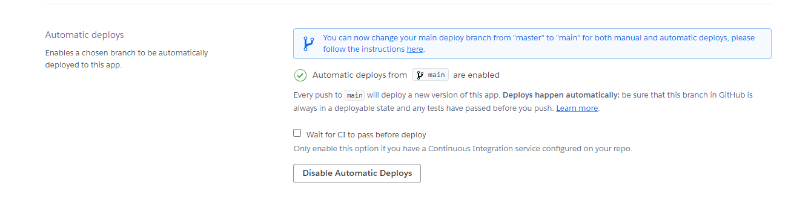

# **Blackjack**
Developed by Michael Roberts

[Link to live site]()

## Introduction
Blackjack, also known as 21, is a card game where players attempt to reach a score of 21 — without exceeding it — before the dealer hits 17. You can win if you don't bust and your total is higher than the dealer cards.

## Contents
* [Project Goals](#project-goals) 
    * [User Goals](#user-goals)
    * [Site Owner Goals](#site-owner-goals)
* [User Experience](#user-experience) 
    * [Target Audience](#target-audience)
    * [User Requirements](#user-requirements)
    * [User Manual](#user-manual)
    * [User Stories](#user-stories)
* [Technical Design](#technical-design)
    * [Data Models](#data-models)
    * [Flowchart](#flowchart)
* [Features](#features)
    * [App Features](#app-features)
    * [Feature Ideas for future development](#feature-ideas-for-future-development)
* [Technologies Used](#technologies-used)
* [Deployment & Local Development](#deployment--local-development)
* [Testing](#testing)
    * [Validation](#validation)
    * [Manual Testing](#manual-testing)
    * [Automated Testing](#automated-testing)
    * [Bugs](#bugs)
* [Credits](#credits)

## Project Goals

### User Goals

### Site Owner Goals

## User Experience

### Target audience

### User requirements

### User Manual

### User Stories

#### First Time User

#### Returning User 

#### Site Owner

## Technical Design

### Flowchart

### Data Models

## Features

### App Features

### Feature Ideas for Future Development

## Technologies Used

### Languages Used

### Other Tools Used

#### 3rd Party Python Libraries Used

## Deployment & Local Development
The website was deployed to [Heroku](https://id.heroku.com/) using the following process:
1. Login or create an account at [Heroku](https://dashboard.heroku.com/)

2. Click on New > Create new app in the top right of the screen.

3. Add an app name and select location, then click 'create app'.

4. Under the deploy tab of the next page, select connect to GitHub.
5. Log in to your GitHub account when prompted.

6. Select the repository that you want to be connected to the Heroku app.

7. Click on the settings tab.

8. Scroll down to the config vars section, and add 2 config vars:
    * The first key is CREDS and the value here is the creds.json file that was generated for the google sheets API to work properly.
    * The second key is PORT and the Value is 8000

9. Once you have set up the config vars, scroll down to buildpacks (still under the settings tab)
10. Add the Python and Node.js buildpacks to your app and make sure that when they are displayed, they appear in the order:
    * Python
    * Node.JS

11. Navigate back to the settings tab.
12. Select automatic deploys to allow Heroku to build the site with new changes each time changes are pushed to GitHub.

13. In the 'manual deploy' section beneath this, make sure the branch selected is 'main' and click deploy branch.

14. The site should now be built and Heroku should provide a url for the built site.

This repository can be forked using the following process:
1. On the repository's page, go to the top-right of the page underneath the dark ribbon.
2. Click on the fork button
3. You can now work on a fork of this project. 

This repository can be cloned using the following process:
1. Go to this repository's page on GitHub.
2. Click on the code button (not the one in the navbar, but the one right above the file list).
3. Select an option, HTTPS, SSH, GitHub CLI.
4. Copy the url below to your clipboard.
5. Open Git Bash/your IDE terminal.
6. Ensure the directory you are working in is the correct one you want to paste the project into.
7. Type the command '$ git clone'
8. Paste the URL of the repository after this.
9. Hit enter on your keyboard and the project will be cloned.

## Testing

### Debugging

### Validation

#### PEP8 Python Validator (Code Institute)

### Manual Testing

### Automated Testing

### Bugs

## Credits

### 3rd Party Code Used

#### 3rd Party Python Libraries/Modules

### Acknowledgements

